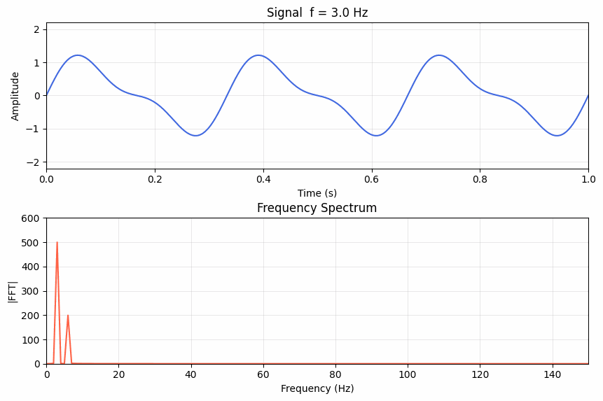
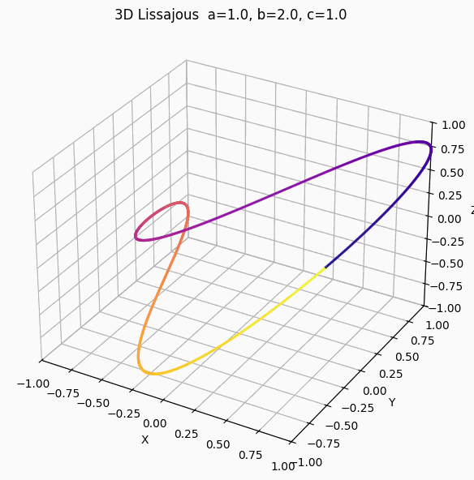

# mpl_animator.py

Turn any static matplotlib script into an animated GIF by sweeping a variable.

## Install

```bash
pip install matplotlib numpy Pillow
```

## Usage

```bash
# Basic: animate variable `f` from 3 to 60
python mpl_animator.py wave_static.py --var f --range "3,60"

# Math expressions in range, custom frame count and FPS
python mpl_animator.py plot.py --var t --range "0,2*pi" --frames 60 --fps 30

# Control output quality and parallelism
python mpl_animator.py plot.py --var alpha --range "0,1" --dpi 150 --workers 8

# Custom output filename
python mpl_animator.py plot.py --var t --range "0,1" --out my_animation.gif
```

This generates a `<script>_animated.py` file. Run it to produce the GIF:

```bash
python wave_static_animated.py              # parallel (default)
python wave_static_animated.py --sequential # single-threaded fallback
```

## Examples

### Example 1 - Wave & spectrum (2D)

`wave_static.py` plots a signal and its frequency spectrum for a fixed frequency `f`:

```python
# wave_static.py  (key lines)
f   = 10.0                          # <- variable to animate
t   = np.linspace(0, 1, 1000)
y   = np.sin(2*np.pi*f*t) + 0.4*np.sin(2*np.pi*2*f*t)

freqs    = np.fft.rfftfreq(len(t), d=t[1]-t[0])
spectrum = np.abs(np.fft.rfft(y))

fig, (ax1, ax2) = plt.subplots(2, 1, figsize=(9, 6))
ax1.plot(t, y, 'royalblue', lw=1.5)
ax2.plot(freqs, spectrum, 'tomato', lw=1.5)
plt.show()
```

Animate `f` from 3 Hz to 60 Hz:

```bash
python mpl_animator.py examples/wave_static.py --var f --range "3,60" --frames 60 --fps 20
python wave_static_animated.py
```

The animator detects that `y`, `spectrum` depend on `f`, moves them into the per-frame `update()`, and keeps the figure/axes creation static - so only the data redraws each frame.



---

### Example 2 - 3D Lissajous curve

`lissajous_3d_static.py` draws a 3D Lissajous figure for fixed frequency ratio `a`:

```python
# lissajous_3d_static.py  (key lines)
a  = 3.0          # <- variable to animate
b  = 2.0
c  = 1.0

t = np.linspace(0, 2 * np.pi, 1000)
x = np.sin(a * t + delta)
y = np.sin(b * t)
z = np.sin(c * t)

fig = plt.figure(figsize=(8, 6))
ax  = fig.add_subplot(111, projection='3d')
ax.scatter(x, y, z, c=colors, s=2, alpha=0.8)
ax.set_title(f"3D Lissajous  a={a:.1f}, b={b:.1f}, c={c:.1f}")
plt.show()
```

Animate `a` from 1 to 6, sweeping through different curve topologies:

```bash
python mpl_animator.py examples/lissajous_3d_static.py --var a --range "1,6" --frames 80 --fps 20
python lissajous_3d_static_animated.py
```

For 3D plots the animator calls `fig.clear()` and recreates the axes each frame (required to preserve the `projection='3d'` state), then re-runs all drawing commands with the new value of `a`.



---

## How it works

1. Parses your script's AST to find which variables depend on the animated one
2. Splits code into **static** (run once) and **dynamic** (recalculated per frame)
3. Generates a new script with `FuncAnimation` (sequential) and `multiprocessing` (parallel) renderers

## Library usage

```python
from mpl_animator import animate

src = open("my_plot.py").read()
animated_code = animate(src, var="t", range_str="0,6.28", frames=60, fps=25)
open("my_plot_animated.py", "w").write(animated_code)
```

## Supported plot types

2D (plot, scatter, bar, hist, contour, imshow, ...), 3D (plot_surface, scatter3D, ...), polar, and anything else matplotlib draws.

## Tests

```bash
pytest test_animator.py -v              # fast tests (111)
pytest test_animator.py -v -m slow      # slow tests that generate actual GIFs
```

---

Built with the assistance of [Claude Code](https://claude.ai/claude-code)
